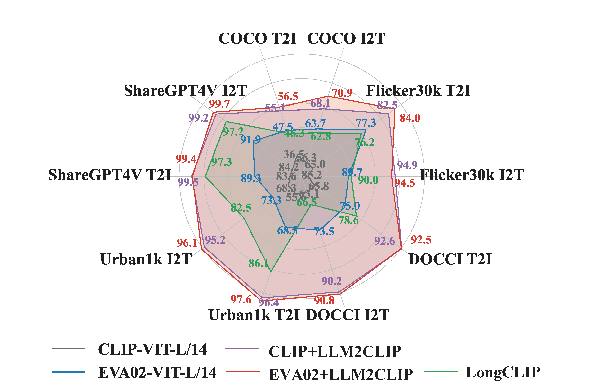

# LLM2CLIP: Unlocking Richer Visual Representations with a Powerful Language Model

Welcome to the official repository for **LLM2CLIP**! This project leverages large language models (LLMs) as powerful textual teachers for CLIP's visual encoder, enabling more nuanced and comprehensive multimodal learning.

[](https://arxiv.org/abs/2411.04997) [](https://aka.ms/llm2clip) [](https://huggingface.co/collections/microsoft/llm2clip-672323a266173cfa40b32d4c)  
**Paper:** Preprinted and under-review now. Accepted to NeurIPS 2024 Workshop: Self-Supervised Learning - Theory and Practice

---


## Challenges with Existing CLIP

Current versions of CLIP face several limitations:

- **Limited Context Window**: The text encoder has a short context window of only 77 tokens, which restricts its understanding of lengthy inputs.
- **Weak Text Comprehension**: The text encoder is relatively limited in its ability to comprehend complex text, often functioning as a bag-of-words model with limited depth.

## Why Integrate LLM with CLIP?

LLM2CLIP brings the unimaginable power of large language models to CLIP, even surpassing native language capabilities. Our LLM2CLIP, fine-tuned purely on an English corpus, outperforms standard Chinese CLIP models:

1. **Extended Input Window**: The LLM expands CLIP's input window, allowing richer textual context and better comprehension of long inputs.
2. **Enhanced Understanding**: With LLM's help, CLIP gains a deeper understanding of dense, complex captions, leading to improved text-image alignment.
3. **Open-World Knowledge**: The LLM provides open-world knowledge, enabling more globally informed multimodal feature alignment and boosting training efficiency.

## Key Challenges

While LLMs have strong inherent text encoding capabilities, the output space is often not highly separable, which limits their effectiveness for contrastive learning.


## Our Approach

To overcome these challenges, we designed a **Caption-to-Caption Contrastive Learning** strategy. We trained the LLM to better differentiate between captions of the same or different images, enhancing the separability of the LLM's output space. During training, the LLM gradients were frozen while CLIP's visual encoder was fine-tuned on limited data, resulting in significant performance gains. 

Through this strategy, we better utilized the LLM's power to comprehend and process **long and dense captions**, improving the overall representation capabilities.

## What Can You Achieve with LLM2CLIP?

1. **Enhanced CLIP Models**: Fine-tune pretrained CLIP models with dense captions or task-specific image-text datasets, making CLIP stronger for various use cases.
2. **Out-of-the-Box Power**: Directly use our enhanced CLIP models, significantly upgraded with LLM guidance for superior performance in multimodal tasks.

---

## News 🚀🚀🚀
- **[2024-11-08]** We are currently training a **scaled-up** version with ten times the training dataset, along with upcoming updates: EVA ViT-E, InternVL-300M, SigCLIP-SO-400M, and more VLLM results trained with LLM2CLIP. Stay tuned for the most powerful CLIP models, and thank you for your star!
- **[2024-11-06]** OpenAI's CLIP and EVA02's ViT base and large models are now available on [HuggingFace](https://huggingface.co/collections/microsoft/llm2clip-672323a266173cfa40b32d4c). 
- **[2024-11-01]** Our paper was accepted to the NeurIPS 2024 SSL Workshop!

---


## Model Zoo (Continuously Updated)

Stay tuned for updates on pretrained models and datasets, which will be made available in the [HuggingFace Model Zoo](https://huggingface.co/collections/microsoft/llm2clip-672323a266173cfa40b32d4c).

---

## 💻 Installation Guide

1. **Create the environment**:

   ```bash
   conda create -n llm2clip python=3.8
   conda activate llm2clip
   pip install -r requirements.txt
   ```
2. **Data Preparation**:

   *(Coming Soon)*

3. **🔥 Training**:

   ```bash
   sh run.sh
   ```
## ❤️ Acknowledgements

Our code is built on top of [EVA-CLIP](https://github.com/baaivision/EVA/tree/master/EVA-CLIP). We would like to thank the EVA team for their foundational work.

## Citation

If you use our work, please cite:

```
@misc{huang2024llm2clippowerfullanguagemodel,
      title={LLM2CLIP: Powerful Language Model Unlock Richer Visual Representation}, 
      author={Weiquan Huang and Aoqi Wu and Yifan Yang and Xufang Luo and Yuqing Yang and Liang Hu and Qi Dai and Xiyang Dai and Dongdong Chen and Chong Luo and Lili Qiu},
      year={2024},
      eprint={2411.04997},
      archivePrefix={arXiv},
      primaryClass={cs.CV},
      url={https://arxiv.org/abs/2411.04997}, 
}
